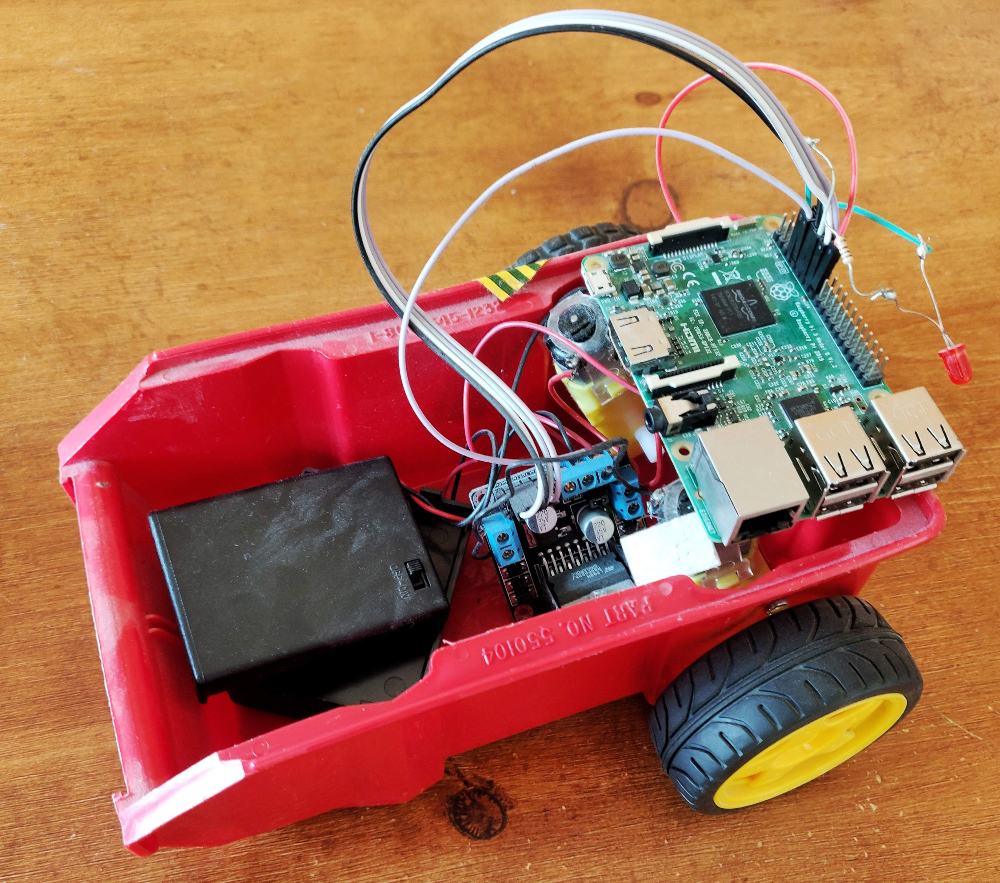

# RasPiRobot
### **I made this a long time ago and the code is very bad.**
Raspberry pi robot using wiring pi and cwiid.

This is the code for a robot car I made that can be controlled by a wii remote.

